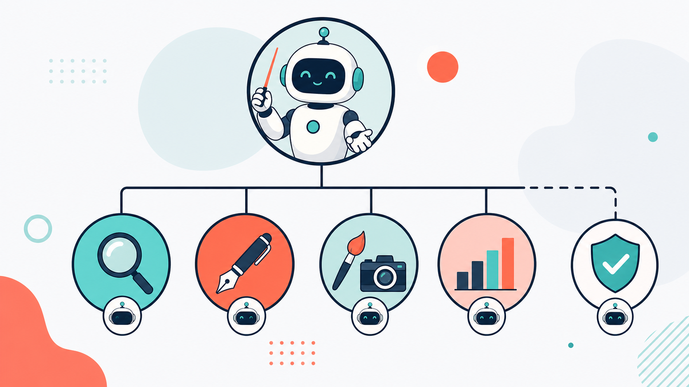
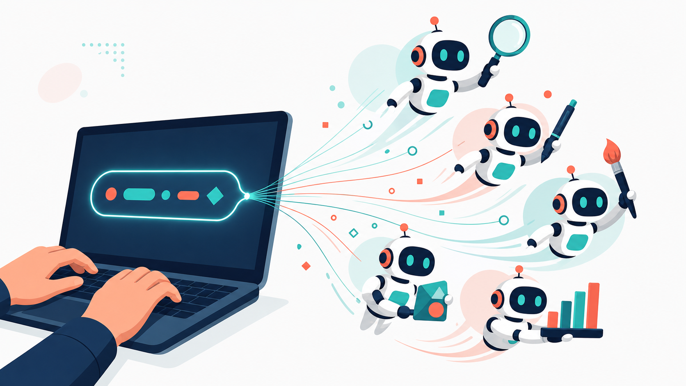

# C1 · 하네스 첫걸음

> "한 문장으로 나만의 AI 팀을 만든다." 오늘 여러분은 팀장이 됩니다.


## 0. 이 과정 한눈에

- **대상:** 광고 실무자 전원 (기획/AE, 크리에이티브, 미디어, 콘텐츠) — 코딩 지식 0을 전제합니다.
- **소요 시간:** 120분 (개념 → 시연 → 실습 → 리뷰)
- **선수 과정:** 없음 (여기가 출발점입니다)
- **사용 하네스:** `starter-harness` — 리서처와 카피라이터로 이루어진 첫 미니 팀
- **얻어가는 것(산출물):**
  - "제로톡" 신제품 음료의 **시장 요약 1페이지**
  - **광고 헤드라인 5개**
  - 앞으로 계속 재사용할 **나의 첫 AI 팀**과 **좋은 요청문 3요소** 감각

이 과정의 목표는 코드를 배우는 게 아닙니다. 여러분은 **팀장 역할**만 합니다. 일을 나눠 맡기고, 결과를 검수하고, 마음에 안 들면 다시 요청하는 것 — 이미 매일 하고 계신 일입니다.

---

## 1. 왜 이 하네스인가

**Before — 혼자 다 하던 방식.** 신제품 캠페인 브리프가 떨어졌습니다. 시장을 검색하고, 경쟁사를 뒤지고, 정리하고, 그제야 헤드라인을 고민합니다. 반나절이 지나갑니다. 조사가 얕으면 카피도 흔들립니다.

**After — 팀에게 맡기는 방식.** "조사하는 사람 하나, 카피 쓰는 사람 하나가 필요해"라고 **한 문장**으로 부탁하면, AI가 그 두 역할을 가진 작은 팀을 만들어 줍니다. 조사한 사람의 결과를 카피라이터가 곧바로 이어받아 헤드라인을 뽑습니다. 여러분은 결과를 받아 검수하고, "더 위트있게"처럼 방향만 조정합니다.


혼자서 순서대로 하던 일을, **역할을 나눈 팀이 이어달리기**로 처리합니다. 이 이어달리기 방식이 오늘 배우는 첫 번째 협업 패턴, **파이프라인**입니다.

---

## 2. 개념 이해

### 하네스란 무엇인가 — 3층 구조

하네스는 "하네스 구성해줘"라는 한 문장으로, 여러분의 업무 설명을 **AI 팀**으로 바꿔 주는 도구입니다. 그 팀은 세 개의 층으로 되어 있습니다. 광고 대행사 조직을 그대로 떠올리면 됩니다.



| 층 | 이 교재에서 부르는 이름 | 광고팀 비유 | 하는 일 |
|---|---|---|---|
| 오케스트레이터 | **팀장** | 팀장 | 누가 언제 무슨 일을 할지 지휘하고, 결과를 모읍니다 |
| 에이전트 | **팀원** | 조사 담당·카피라이터 | 각자 맡은 전문 업무를 실제로 수행합니다 |
| 스킬 | **업무 매뉴얼** | 팀원 책상 위 업무 지침서 | 팀원이 "어떻게" 일하는지 적힌 방법서입니다 |

핵심은 이 분리입니다. **"누가(팀원)"** 와 **"어떻게(업무 매뉴얼)"** 가 따로 존재합니다. 그래서 사람은 그대로 두고 방법만 바꾸거나, 방법은 그대로 두고 사람을 추가할 수 있습니다.

### "하네스 구성해줘" 한 문장이 팀이 된다

여러분이 업무를 말로 설명하면, 하네스가 그 설명을 분석해서 필요한 팀원을 뽑고, 각자에게 업무 매뉴얼을 붙여 줍니다. 코드를 짜는 게 아니라 **말로 팀을 조직**하는 것입니다.



> **AI는 매번 조금씩 다르게 답합니다(비결정성).** 같은 문장을 넣어도 옆 사람과 결과가 다를 수 있습니다. 이건 고장이 아니라 정상입니다. 그래서 우리는 결과를 **한 번은 의심하고**, 마음에 안 들면 다시 요청하는 습관을 들입니다. 이 검증 습관이 오늘부터 6과정 내내 따라다니는 가장 중요한 태도입니다.

### 6가지 협업 패턴 — 이름만 먼저

팀이 협업하는 방식은 상황에 따라 6가지가 있습니다. 오늘은 **이름만** 익히세요. 각 방식은 앞으로 한 과정씩 깊게 배웁니다.

| 패턴 | 한 줄 뜻 | 배우는 과정 |
|---|---|---|
| **파이프라인** | 앞사람 결과를 뒷사람이 이어받는 순차 협업 (조사→카피) | **오늘 C1**, C5 |
| **팬아웃/팬인** | 여러 명이 동시에 조사한 뒤 하나로 종합 | C2 |
| **생성-검증** | 만드는 사람과 검수하는 사람을 나눔 | C3 |
| **감독자** | 중앙의 지휘자가 일을 나눠 맡기고 취합 | C4 |
| **전문가 풀** | 그때그때 필요한 전문가만 골라 호출 | C6 |
| **계층적 위임** | 큰 일을 잘게 쪼개 아래로 위임 | C6 |

오늘 우리가 쓰는 건 가장 기본인 **파이프라인** 하나입니다. 조사한 사람의 결과를 카피라이터가 받아쓰는, 이어달리기 한 판입니다.

### 팀 모드 vs 서브에이전트 모드

- **에이전트 팀 모드(오늘 사용):** 여러 팀원이 **서로 협업**합니다. 조사 담당이 낸 결과를 카피라이터가 받아 이어가는, 진짜 팀워크입니다.
- **서브에이전트 모드:** 팀원 한 명에게 **단발성**으로 일을 시키는 방식입니다. 협업이 없습니다.

우리는 팀워크를 체험하려는 것이므로 **팀 모드**를 켜고 시작합니다. 만약 팀이 아니라 한 번에 답 하나만 나온다면 팀 기능이 꺼진 것이니, 4장 준비 단계를 확인하세요.

### 좋은 요청문의 3요소 — 도메인·역할·산출물

하네스에게 일을 부탁할 때 세 가지만 챙기면 팀이 헤매지 않습니다.

| 요소 | 질문 | "제로톡" 예 |
|---|---|---|
| **도메인** | 무슨 일인가? | 신제품 음료 런칭을 돕는 일 |
| **역할** | 누가 필요한가? | 시장을 조사하는 리서처 + 헤드라인을 뽑는 카피라이터 |
| **산출물** | 무엇을 몇 개/몇 장 받나? | 조사 요약 1페이지 + 헤드라인 5개 |

이 3요소는 오늘뿐 아니라 앞으로 모든 요청문의 기본 뼈대입니다.

---

## 3. 사용할 하네스

오늘 사용할 팀장(오케스트레이터)은 **`starter-harness`** 입니다. 첫 하네스 실습을 위한 가장 단순한 파이프라인 팀장으로, 아래 두 팀원을 순서대로 엮습니다.

### 팀 구성표

| 순서 | 팀원(역할) | 광고팀 비유 | 하는 일 | 넘겨주는 결과 |
|---|---|---|---|---|
| 1 | **리서처** | 조사 담당 | 시장·경쟁 상황을 빠르게 조사 | 시장 요약 1페이지 |
| 2 | **카피라이터** | 카피라이터 | 리서처의 요약을 받아 헤드라인 집필 | 광고 헤드라인 5개 |

리서처 → 카피라이터. 앞사람의 결과가 뒷사람의 입력이 되는 전형적인 **파이프라인**입니다. 팀장(`starter-harness`)은 이 순서를 관리하고 두 결과를 하나로 묶어 여러분에게 전달합니다.

### 트리거 프롬프트

아래 문장이 이 팀을 깨우는 **트리거**입니다. 이 한 문장 안에 3요소(도메인·역할·산출물)가 모두 들어 있는지 눈으로 확인해 보세요.

```text
하네스 구성해줘. 신제품 음료 런칭을 돕는 작은 팀이 필요해 — 시장/경쟁 상황을 빠르게 조사하는 리서처와, 그 조사를 바탕으로 광고 헤드라인을 뽑는 카피라이터. 조사 요약 1페이지와 헤드라인 5개를 결과로 줘.
```

---

## 4. 실습 — 단계별

이제 직접 "제로톡" 미니 팀을 돌려봅니다. **제로톡**은 이 아카데미가 6과정 내내 사용하는 가상 브랜드(제로 슈거 스파클링 음료)입니다. 실제 회사 자료 대신 이 가상 브랜드로 안전하게 연습합니다.

### 준비 (실습 전 점검)

- Claude Code가 실행되어 있고, 플러그인 목록에 **harness**가 보이나요?
- **에이전트 팀 기능**이 켜져 있나요? (팀이 아니라 답 하나만 나오면 꺼진 것입니다 — 6장 참고)
- 실습용 작업 폴더(예: `harness-lab`)가 하나 준비됐나요?

### 복붙 프롬프트 (그대로 붙여넣기)

```text
하네스 구성해줘. 신제품 음료 런칭을 돕는 작은 팀이 필요해 — 시장/경쟁 상황을 빠르게 조사하는 리서처와, 그 조사를 바탕으로 광고 헤드라인을 뽑는 카피라이터. 조사 요약 1페이지와 헤드라인 5개를 결과로 줘.
```

톤을 바꿔 다시 뽑는 **재요청**(7단계)에는 이 문장을 이어서 넣습니다.

```text
헤드라인을 더 위트있게, 20대가 SNS에서 공유하고 싶어할 톤으로 5개 다시 뽑아줘.
```

### 7단계 따라하기

| 단계 | 할 일 | 기대 결과 |
|---|---|---|
| 1 | Claude Code 실행 → 플러그인 목록에서 harness 확인 | harness가 설치 목록에 보임 |
| 2 | 에이전트 팀 기능이 켜져 있는지 확인 | 팀 기능 on (단일 응답이 아니라 팀 구성됨) |
| 3 | 위 복붙 프롬프트 입력 | 하네스가 도메인을 분석해 **리서처 + 카피라이터 2인 팀**을 제안 |
| 4 | 하네스가 만든 팀원 파일과 업무 매뉴얼 파일을 눈으로 확인 | "누가(팀원)"와 "어떻게(업무 매뉴얼)"가 파일로 분리돼 있음을 목격 |
| 5 | 팀 실행 결과 수령 | **시장 요약 1페이지 + 헤드라인 5개** 확보 |
| 6 | 이 흐름을 라벨링 | "조사→카피 = **파이프라인**"이라고 이름 붙이기 |
| 7 | "더 위트있게" 재요청 | 같은 팀이 **톤만 바꿔 재생성** → "쓸수록 진화한다" 체감 |

> 결과가 옆 사람과 달라도 괜찮습니다(비결정성). 그리고 첫 결과를 그냥 믿지 마세요. 5개 헤드라인을 소리 내어 읽어 보고, 어색하면 7단계처럼 다시 요청하는 것 — 이게 검증입니다.

실습이 지연되면 강사가 준비한 폴백(사전 생성 결과)으로 개념을 이어갑니다. 완성된 결과가 어떤 모습인지는 바로 다음 5장에서 미리 볼 수 있습니다.

---

## 5. 완성형 사례 (worked example)

아래는 위 하네스를 돌렸을 때 **나올 법한** 산출물 예시입니다. 브랜드와 수치는 모두 **가상 데이터(예시)** 입니다. 실제 조사 결과가 아니라, "완성되면 이런 모양이구나"를 보여주는 견본으로 읽어 주세요.

### 5-1. 시장 요약 1페이지 — 제로톡 (예시 데이터)

**대상 브랜드:** 제로톡 (ZeroTalk) — 제로 슈거 스파클링 음료 · 여름 신제품 런칭
**작성:** 리서처 팀원 · **분량:** 1페이지 요약

**① 카테고리 상황 (예시 데이터)**
- 국내 제로 슈거 탄산·스파클링 음료 시장은 최근 3년간 연 15% 안팎으로 성장 중인 것으로 보이며, 저당·헬시플레저 트렌드가 성장을 견인.
- 구매의 핵심 동인은 "죄책감 없는 즐거움" — 맛은 지키되 당·칼로리 부담은 덜고 싶은 심리.
- 주 소비층은 20~30대, 특히 자기관리와 SNS 공유에 민감한 라이트 헬스족.

**② 소비자 페인포인트 (예시 데이터)**
- "제로는 맛이 밍밍하다"는 인식이 여전히 잔존 — 맛 만족도가 재구매의 최대 관문.
- 인공감미료 뒷맛에 대한 거부감이 일부 존재.
- 제품이 너무 많아 무엇이 진짜 "맛있는 제로"인지 고르기 피로.

**③ 경쟁 포지셔닝 (예시 데이터)**
- 기존 대형 브랜드: "익숙함·안전함"으로 넓게 커버하나 젊은 층에는 다소 올드한 인상.
- 신생 스파클링 브랜드: "세련된 디자인·이색 플레이버"로 SNS에서 화제이나 대중 인지도는 낮음.
- **제로톡의 빈틈:** "제대로 맛있는 제로" + "SNS에서 말 걸고 싶어지는 위트" 조합은 아직 비어 있음.

**④ 캠페인 방향 시사점 (예시 데이터)**
- 핵심 메시지 축: **맛(밍밍함 반전) × 위트(공유하고 싶은 말투)**.
- 톤앤매너: 젊고 가볍고, 자기관리를 설교하지 않는 친구 같은 목소리.
- 1차 타겟: 20대 후반, "건강도 챙기지만 재미가 우선"인 SNS 액티브 소비자.

### 5-2. 광고 헤드라인 5개 (예시 데이터)

카피라이터 팀원이 위 요약의 "맛 × 위트" 방향을 받아 집필한 견본입니다.

1. **제로인데, 왜 이렇게 할 말이 많아?**
2. **밍밍함은 옛날 제로 얘기.** 제로톡은 톡 쏘고 할 말도 쏜다.
3. **오늘의 죄책감: 0. 오늘의 수다: 무제한.**
4. **다이어트는 내일부터, 제로톡은 지금부터.**
5. **당은 뺐는데 재미는 못 뺐다.**

> 위 헤드라인은 견본입니다. 실제 실습에서는 여러분의 팀이 조금 다른 5개를 낼 것입니다(비결정성). 나온 카피를 그대로 쓰기 전에, 브랜드 톤에 맞는지 한 번 검수하고 필요하면 재요청하세요.

---

## 6. 자주 하는 실수

| 실수 | 이렇게 하세요 |
|---|---|
| **산출물을 안 적어서** 팀이 무엇을 만들지 모호해짐 | 요청문에 항상 3요소(도메인·역할·산출물)를 넣으세요. "1페이지", "5개"처럼 **형식·개수**를 명시합니다. |
| **팀 기능이 꺼져** 팀 대신 답 하나만 나옴 | 에이전트 팀 기능이 켜졌는지 확인하세요. 협업이 목적이면 반드시 팀 모드로 시작합니다. |
| **트리거 문장이 부정확**해 하네스가 안 깨어남 | "하네스 구성해줘"라는 표현을 정확히 사용하고, harness 플러그인이 설치·활성화됐는지 확인합니다. |
| **첫 결과를 그냥 믿고** 검증을 건너뜀 | 결과를 한 번은 의심하세요. 어색하면 톤·타겟을 덧붙여 재요청하는 것이 정상 절차입니다. |

---

## 7. 체크리스트 & 자기평가

### 완주 체크리스트

- [ ] 하네스의 3층 구조(팀장·팀원·업무 매뉴얼)를 내 말로 설명할 수 있다
- [ ] "하네스 구성해줘" 한 문장으로 리서처+카피라이터 팀을 만들었다
- [ ] "누가(팀원)"와 "어떻게(업무 매뉴얼)"가 파일로 분리됨을 확인했다
- [ ] 시장 요약 1페이지 + 헤드라인 5개를 받았다
- [ ] 이 흐름이 "파이프라인(조사→카피)"임을 라벨링했다
- [ ] "더 위트있게" 재요청으로 톤을 바꿔 재생성했다(진화 체험)
- [ ] 요청문에 3요소(도메인·역할·산출물)를 모두 넣었다

### 자기평가 루브릭 요약 (R-C1 · 70점 이상 통과)

| 평가 항목 | 배점 | 우수 기준 |
|---|---|---|
| **개념 이해** | 30 | 팀장·팀원·업무 매뉴얼 3층 구조를 광고팀 비유로 스스로 설명 |
| **설치·실행** | 30 | 도움 없이 설치·팀 활성화·첫 하네스 실행을 완료 |
| **요청문 품질** | 25 | 도메인·역할·산출물 3요소를 모두 명시 |
| **검증 태도** | 15 | 결과를 무비판 수용하지 않고 재요청으로 개선 |

각 항목은 미흡/보통/우수 3단계로 스스로 점검하고, 합산 70점 이상이면 다음 과정으로 넘어갈 준비가 된 것입니다.

---

## 8. 다음 과정

오늘 여러분은 **파이프라인** 팀 하나로 첫걸음을 뗐습니다. 다음은 여러 명이 **동시에** 조사하는 팀입니다.

**C2 — 리서치·인사이트 하네스 (팬아웃/팬인)**
> "하루 걸리던 카테고리 진단을 한 시간에." 시장·소비자·경쟁·트렌드를 네 명이 동시에 조사하고(팬아웃), 한 명이 교차검증해 하나의 인사이트 보고서로 종합합니다(팬인).

**과제:** 오늘 만든 "제로톡" 팀을, 여러분이 실제 담당하는 브랜드로 바꿔 한 번 더 돌려 보세요. 3요소만 바꾸면 됩니다.

<!-- web: nav prev=none next=course2-research -->
