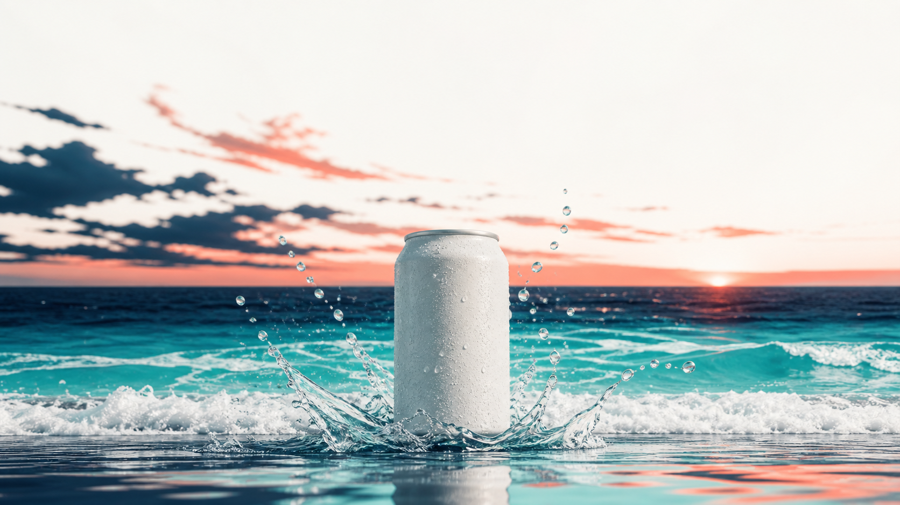
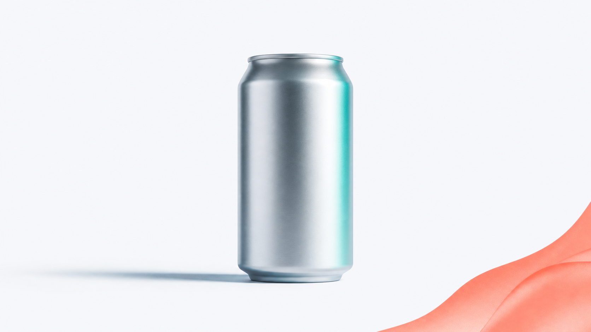
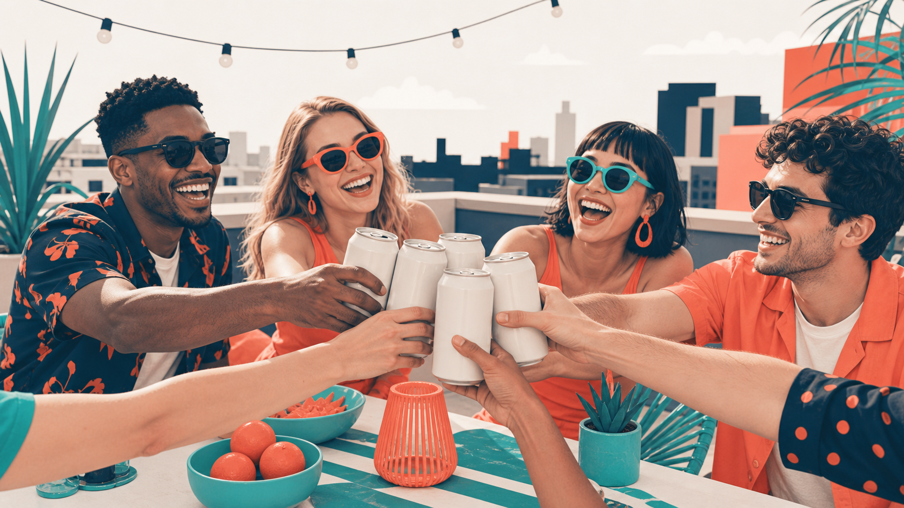
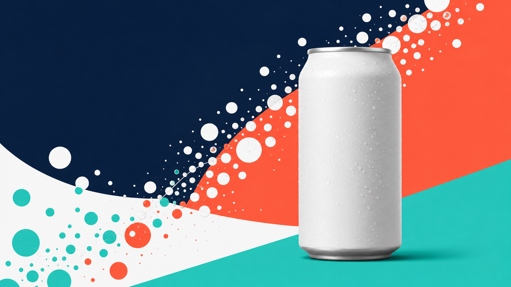

# C3 · 크리에이티브 제작 하네스

> 카피와 비주얼은 팀으로 뽑고, 아트디렉터가 검수한다 — 만드는 손과 보는 눈을 나누면 결과가 달라집니다.

## 0. 이 과정 한눈에

- **대상:** 크리에이티브(카피/아트), 기획 실무자
- **소요:** 150분
- **선수과정:** C1 하네스 첫걸음
- **사용 하네스:** `creative-harness` (패턴: 생성-검증)
- **얻어가는 것(산출물):**
  - 감성/기능/유머 3앵글 추천 카피 3세트
  - 키비주얼 컨셉 4안
  - 아트디렉터 검수 코멘트(통과·반려·재생성 지시)
  - 무드보드 요약
  - 재사용 가능한 나만의 크리에이티브 하네스

---

## 1. 왜 이 하네스인가

크리에이티브 회의를 떠올려 보세요. 카피라이터가 헤드라인을 여러 개 던지고, 디자이너가 시안을 몇 장 깔고, 아트디렉터가 "이건 톤이 안 맞아, 다시"라고 말합니다. 좋은 광고는 **만드는 사람과 검수하는 사람이 나뉘어 있을 때** 나옵니다. 혼자 만들고 혼자 "괜찮네" 하면, 자기 시안을 사랑하는 눈을 못 이깁니다.

혼자 AI에게 "카피랑 비주얼 뽑아줘"라고 하면 딱 그런 상황이 됩니다. 만든 결과를 만든 그 자리에서 스스로 칭찬하고 끝나 버립니다.

| 구분 | Before (혼자 뽑기) | After (크리에이티브 하네스) |
|---|---|---|
| 카피 | 한 방향 헤드라인 몇 개 | 감성·기능·유머 3앵글 × A/B로 비교 가능한 세트 |
| 비주얼 | 시안 1~2장, 톤 제각각 | 통일 팔레트로 4안 병렬 생성 |
| 검수 | 없음(자기만족) | 아트디렉터가 브랜드 톤 기준으로 통과·반려 |
| 품질 | 첫 결과에서 멈춤 | 반려→재생성 루프로 올라감 |

이 과정이 만드는 것은 "빨리 뽑아주는 기계"가 아니라 **뽑고, 검수하고, 다시 뽑는 작은 크리에이티브 조직**입니다.

---

## 2. 개념 이해 — 생성-검증

### 만드는 사람 ≠ 검수하는 사람

생성-검증은 팀을 **두 손**으로 나누는 방식입니다.

- **만드는 손(생성):** 카피라이터, 비주얼 디자이너. 자유롭게 여러 안을 쏟아냅니다.
- **보는 눈(검증):** 아트디렉터. 만든 사람과 다른 자리에서, 브랜드 기준으로만 봅니다.

핵심 규칙: **같은 맥락에서 자기 것을 자기가 검수하지 않습니다.** 카피라이터가 "내 카피 좋죠?"라고 스스로 판정하면 검수가 아니라 자기변호가 됩니다. 그래서 검수는 반드시 별도 팀원(아트디렉터)에게 맡깁니다.

### 리뷰 게이트 — 통과 못하면 못 나간다

아트디렉터는 결과물 앞에 서 있는 **문지기(리뷰 게이트)** 입니다.

```
[카피라이터] ─┐
              ├─▶ [아트디렉터 리뷰 게이트] ─▶ 통과 → 최종 패키지
[비주얼 디자이너] ─┘         │
                            └─ 톤 위반 → 반려 · 재생성 지시 → 다시 생성
```

브랜드 톤에 맞으면 통과, 어긋나면 **반려하고 재생성을 지시**합니다. 이 "반려→재생성"이 한 바퀴 돌 때마다 품질이 올라갑니다.

### codex-image 병렬 컨셉 생성

비주얼 디자이너는 키비주얼을 한 장씩 순서대로 그리지 않습니다. **여러 컨셉을 한 번에 나란히** 만들어 냅니다(병렬 생성, 최대 4~5안). 청량한 해변 버전, 미니멀 제품샷 버전, 활기찬 라이프스타일 버전을 동시에 깔아 놓고 비교하는 것이죠. 컨셉이 여러 개여야 아트디렉터가 고르고 버릴 수 있습니다.

> **이미지 안에는 글자를 넣지 않습니다.** AI가 그린 글자는 오탈자가 나기 쉬워서, 카피(글자)는 나중에 디자인 단계에서 얹습니다. 이미지는 "비주얼 무드"만 담당합니다.

### 카피 A/B — 같은 메시지, 다른 앵글

하나의 제품 메시지도 **말을 거는 각도**를 바꾸면 도달하는 사람이 달라집니다.

| 앵글 | 무엇을 건드리나 | 예시 톤 |
|---|---|---|
| 감성 | 기분·순간·감정 | "이 여름, 죄책감 없이 시원하게" |
| 기능 | 사실·이점·근거 | "설탕 0g, 칼로리 0, 청량함은 그대로" |
| 유머 | 위트·반전·공유 욕구 | "다이어트 중이라 물만 마신다는 거짓말" |

세 앵글을 다 뽑아 비교하는 것이 카피 A/B입니다. 광고주에게 하나만 보여주는 게 아니라, 서로 다른 문을 세 개 열어 보여 주는 셈입니다.

> **AI는 매번 조금씩 다르게 답합니다(비결정성).** 같은 브리프를 두 번 넣어도 헤드라인 문구는 달라질 수 있습니다. 이건 고장이 아니라 정상입니다. 그래서 우리는 결과를 **한 번은 의심하고 검수**합니다 — 그 역할이 아트디렉터입니다.

---

## 3. 사용할 하네스 — creative-harness

### 팀 구성표

| 팀원(역할) | 광고팀 비유 | 하는 일 | 단계 |
|---|---|---|---|
| 카피라이터 | 카피라이터 | 감성/기능/유머 3앵글로 헤드라인·바디·CTA 창작 | 생성 |
| 비주얼 디자이너 | 디자이너 | 키비주얼 컨셉 4안 병렬 생성(codex-image) | 생성 |
| 아트디렉터 | 아트디렉터(검수) | 브랜드 톤 기준으로 검수·반려·재생성 지시 | 검증 |

- **팀장(오케스트레이터):** `creative-harness`. 카피라이터와 비주얼 디자이너를 **동시에** 생성으로 돌리고, 결과를 아트디렉터에게 넘겨 검수받습니다. 반려가 나오면 해당 팀원에게 재작업을 시킵니다.
- **협업 방식:** 생성(둘) → 검증(하나) → 반려 시 되돌림. 이것이 생성-검증 패턴입니다.

### 트리거 프롬프트 (복붙)

```text
크리에이티브 제작 하네스를 구성해줘. 광고 카피를 감성/기능/유머 세 앵글로 뽑는 카피라이터, 키비주얼 컨셉을 여러 장 생성하는 비주얼 디자이너(codex-image 사용), 그리고 브랜드 톤앤매너 기준으로 결과를 검수하고 반려·재생성을 지시하는 아트디렉터가 필요해. 최종적으로 '추천 카피 3세트 + 키비주얼 컨셉 4안 + 아트디렉터 코멘트'를 줘.
```

이 한 문장에 **도메인(크리에이티브 제작)·역할(카피/비주얼/아트디렉터)·산출물(카피 3세트+키비주얼 4안+코멘트)** 3요소가 다 들어 있습니다. 하네스 요청문은 항상 이 3요소로 확인하세요.

---

<!-- construction-section -->
## 3-B. 이 하네스를 직접 만들기 — `/harness` 구성

이 과정의 크리에이티브 하네스도, harness 플러그인에게 아래 한 문장을 주면 '만드는 팀원'과 '검수하는 팀원'이 분리된 생성-검증 팀으로 자동 생성됩니다. 팀장(오케스트레이터)·팀원(에이전트)·업무 매뉴얼(스킬)이 한 번에 만들어집니다. 여러분도 아래 방법으로 직접 만들 수 있습니다.

> harness 플러그인은 **C1(하네스 첫걸음)** 에서 이미 설치했다고 가정합니다. 아직이라면 C1의 설치 안내를 먼저 따르세요(보통 관리자가 미리 설치해 둡니다).

**이 하네스를 만드는 구성 프롬프트 — 그대로 입력하세요**

```text
하네스 구성해줘. 광고 크리에이티브를 만들고 검수까지 하는 팀이 필요해. 카피를 감성·기능·유머로 뽑는 카피라이터와 키비주얼 컨셉을 이미지로 만드는 비주얼 디자이너가 먼저 생성하고, 아트디렉터가 브랜드 톤 기준으로 검수해 미달이면 반려·재생성을 지시하는 '생성-검증' 구조야. 추천 카피와 키비주얼 컨셉, 검수 코멘트를 결과로 줘.
```

**무엇이 만들어지나요**

| 종류 | 생성물 |
|---|---|
| 팀원(에이전트) | `copywriter`(카피라이터), `visual-designer`(비주얼 디자이너), `art-director`(아트디렉터·검수) |
| 업무 매뉴얼(스킬) | `ad-copywriting`, `visual-concepting`, `creative-direction` |
| 팀장(오케스트레이터) | `creative-harness` — 생성-검증(리뷰 게이트) |

> harness는 **6단계**(도메인 분석 → 팀 설계 → 에이전트 생성 → 스킬 생성 → 통합 → 검증)로 팀을 만들고, `CLAUDE.md`에 트리거 포인터를 등록합니다. 한 번 만든 뒤에도 "리서처를 하나 더 추가해줘"처럼 피드백을 주면 **계속 진화**합니다. 실제로 이렇게 생성된 결과물이 이 저장소의 `.claude/agents/`·`.claude/skills/`에 들어 있습니다.

**만든 다음에는** 아래 4장 실습의 트리거 프롬프트로 이 팀을 실행하면 됩니다.

## 4. 실습 — "제로톡" 여름 캠페인 크리에이티브

가상 브랜드 **제로톡**(제로 슈거 스파클링 음료)의 여름 캠페인 크리에이티브 패키지를 만듭니다.

### 4-1. 하네스 구성 (복붙)

```text
크리에이티브 제작 하네스를 구성해줘. 광고 카피를 감성/기능/유머 세 앵글로 뽑는 카피라이터, 키비주얼 컨셉을 여러 장 생성하는 비주얼 디자이너(codex-image 사용), 그리고 브랜드 톤앤매너 기준으로 검수하고 반려·재생성을 지시하는 아트디렉터가 필요해. 최종적으로 '추천 카피 3세트 + 키비주얼 컨셉 4안 + 아트디렉터 코멘트'를 줘.
```

### 4-2. 브리프·브랜드 톤 입력 (복붙)

```text
브랜드: 제로톡 (제로 슈거 스파클링 음료)
캠페인: 여름 시즌, 20~30대 타깃
핵심 메시지: 설탕 0g인데 청량함은 진짜 — 죄책감 없이 시원하게
브랜드 톤앤매너: 젊고 위트있게, 상쾌하고 솔직하게. 과장·의학적 효능 주장 금지, 다이어트 압박 조장 금지.
카피는 감성/기능/유머 3앵글로, 각 앵글마다 헤드라인 + 바디 + CTA. 키비주얼은 서로 다른 컨셉 4안으로.
```

### 4-3. 단계 표

| 단계 | 무엇을 하나 | 누가 | 기대 결과 |
|---|---|---|---|
| 1 | 하네스 구성 | 팀장 | 카피/비주얼/아트디렉터 3인 팀 확인 |
| 2 | 브리프·톤 입력 | 나 | 브랜드 톤이 검수 기준으로 등록됨 |
| 3 | 카피 3앵글 생성 | 카피라이터 | 감성/기능/유머 헤드라인+바디+CTA 초안 |
| 4 | 키비주얼 4안 병렬 생성 | 비주얼 디자이너 | 서로 다른 컨셉 4안(텍스트 없는 이미지) |
| 5 | 톤 검수 | 아트디렉터 | 통과/반려 판정 + 반려 사유 |
| 6 | 반려분 재생성 | 카피/비주얼 | 지적받은 안만 다시 생성(생성-검증 루프) |
| 7 | 패키지 확정 | 팀장 | 추천 카피 3세트 + 키비주얼 4안 + 무드보드 |

### 4-4. 재생성(반려) 시켜 보기 (복붙)

첫 결과가 나오면 일부러 반려 루프를 한 번 돌려 봅니다. 생성-검증의 진짜 가치는 여기서 나옵니다.

```text
아트디렉터 기준으로 유머 앵글 헤드라인이 '다이어트 압박'으로 읽힐 위험이 있으면 반려하고, 압박 대신 위트로 웃게 만드는 방향으로 다시 뽑아줘. 통과한 감성·기능 앵글은 그대로 둬.
```

> 통과한 안은 두고 **반려된 안만** 다시 뽑는 것이 핵심입니다. 매번 전부 새로 뽑으면 힘들게 통과시킨 안까지 날아갑니다.

---

## 5. 완성형 사례 — "제로톡" 여름 캠페인 크리에이티브 패키지

실제로 이 하네스를 돌렸을 때 나올 법한 결과물 전문은 아래 파일에 있습니다.

**➡ [C3 크리에이티브 패키지 전문 보기](../사례/C3_크리에이티브패키지.md)** *(가상 브랜드·예시 데이터)*

### 추천 카피 3세트 (발췌)

| 앵글 | 헤드라인 |
|---|---|
| 감성 | 이 여름, 죄책감은 두고 시원함만 챙기세요 |
| 기능 | 설탕 0g. 칼로리 0. 청량함은 100%. |
| 유머 | "물만 마셔요"… 라고 말하며 몰래 여는 캔 |

각 세트의 바디카피·CTA·검수 결과는 사례 파일 5장에서 확인하세요.

### 키비주얼 컨셉 4안

아래 4안은 아트디렉터 검수를 통과한 최종 컨셉입니다. (이미지는 별도 생성 예정 — 컨셉·무드는 사례 파일 참조)


*1안 · 청량/여름해변: 코발트빛 바다와 튀는 물방울, 코럴 포인트. 시원함을 몸으로 느끼게 하는 감성 컷.*


*2안 · 미니멀 제품샷: 오프화이트 배경 위 캔 하나, 절제된 그림자와 티일 하이라이트. "설탕 0"의 깔끔함을 시각화.*


*3안 · 활기찬 라이프스타일: 옥상 파티, 웃는 사람들의 손에 든 캔. 공유하고 싶은 여름 순간.*


*4안 · 대담한 그래픽: 네이비·코럴·티일의 큰 색면과 탄산 버블 패턴. SNS 썸네일에서 눈에 꽂히는 컷.*

### 아트디렉터 검수 한 줄

> "감성·기능 앵글 통과. 유머 앵글은 초안이 '다이어트 압박'으로 읽혀 **1회 반려** 후 재생성 → 통과. 키비주얼 4안은 팔레트 통일 확인, 2안 그림자만 톤 다운 지시." — 생성-검증 루프가 실제로 한 바퀴 돈 기록입니다.

---

## 6. 자주 하는 실수

| 실수 | 이렇게 하세요 |
|---|---|
| 검수 기준(브랜드 톤)을 안 주고 "검수해줘"라고만 함 → 리뷰가 무의미 | 톤앤매너를 **먼저 문장으로** 적어 아트디렉터에게 기준으로 넣기 |
| 이미지 프롬프트에 "제로톡 로고/글자 넣어줘" 요구 → 오탈자 이미지 | 이미지엔 **텍스트 배제**, 글자는 디자인 단계에서 따로 얹기 |
| 첫 결과가 예뻐서 바로 확정(재생성 루프 생략) | 일부러 **한 번은 반려**시켜 생성-검증의 가치를 체험 |
| 반려 시 전체를 다시 뽑음 → 통과안까지 사라짐 | **반려된 안만** 재생성, 통과안은 유지 지시 |

---

## 7. 체크리스트 & 자기평가

**완주 체크**
- [ ] `creative-harness`로 카피·비주얼·아트디렉터 3인 팀을 구성했다
- [ ] 브랜드 톤앤매너를 검수 기준으로 명문화해 넣었다
- [ ] 카피를 감성/기능/유머 3앵글로 받았다
- [ ] 키비주얼 컨셉 4안을 병렬 생성했다(텍스트 없는 이미지)
- [ ] 아트디렉터의 반려→재생성 루프를 최소 1회 돌렸다
- [ ] 최종 패키지(카피 3세트 + 키비주얼 4안 + 무드보드)를 정리했다

**루브릭 요약 (통과 70%)**

| 항목 | 비중 | 우수 기준 |
|---|---|---|
| 생성-검증 루프 | 30% | 리뷰 게이트 작동, 반려·재생성 활용 |
| 브랜드 톤 기준화 | 25% | 검증 기준을 문장으로 명문화 |
| 비주얼 컨셉 | 25% | 컨셉 다양성·팔레트 적합성 |
| 카피 A/B | 20% | 3앵글 구분·완성도 |

---

## 8. 다음 과정

카피와 비주얼을 팀으로 뽑고 검수까지 마쳤다면, 이제 이 크리에이티브를 **어디에 얼마의 예산으로 태울지**를 정할 차례입니다. C4에서는 감독자 패턴으로 미디어 플랜을 지휘합니다.

- **이전:** C2 리서치·인사이트 하네스 (팬아웃/팬인)
- **다음:** C4 미디어·캠페인 플래닝 하네스 (감독자)

<!-- web: nav prev=course2-research next=course4-media -->
