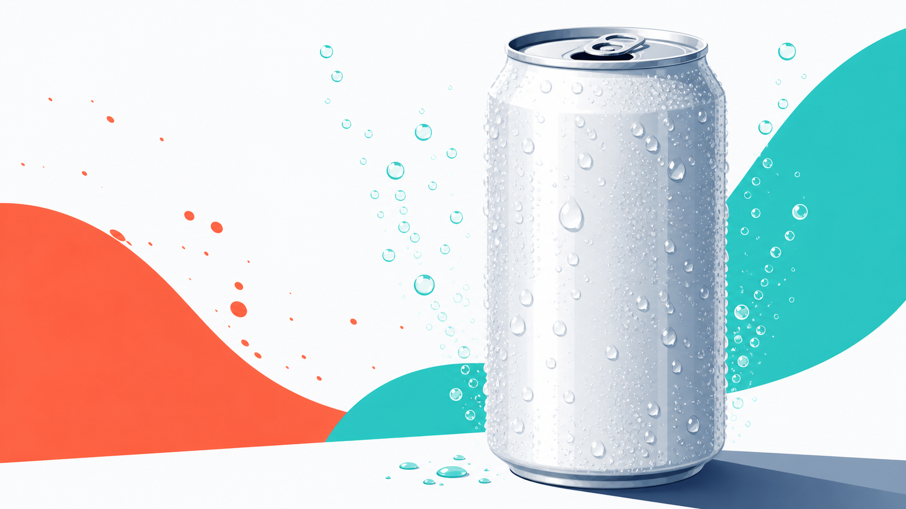
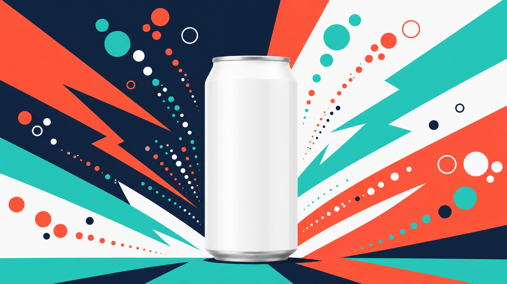

# C5 · 콘텐츠·SNS 제작 하네스

> 트렌드 조사부터 썸네일 컨셉까지, 한 주치 SNS 콘텐츠를 하나의 흐름으로 뽑아냅니다.

## 0. 이 과정 한눈에

- **대상:** 콘텐츠 마케터, SNS 담당, 크리에이티브 실무자
- **소요 시간:** 약 150분
- **선수 과정:** C1(하네스 첫걸음)
- **사용 하네스:** `content-harness` (오케스트레이터 = 팀장)
- **얻어가는 것(산출물):** 1주 콘텐츠 캘린더, 대본 5개, 썸네일 컨셉 3안, 제목·해시태그 세트, 그리고 다음에도 다시 쓸 수 있는 나만의 콘텐츠 하네스

이 과정의 핵심 그림 하나: **앞사람이 끝낸 결과를 뒷사람이 받아 이어가는 순차 협업(파이프라인)**. 조사 → 기획 → 대본 → 썸네일 → SEO가 릴레이처럼 이어집니다.

---

## 1. 왜 이 하네스인가

SNS 콘텐츠 한 편을 만들려면 손이 참 많이 갑니다. 요즘 뭐가 뜨는지 찾아보고, 주제를 잡고, 대본을 쓰고, 썸네일을 구상하고, 마지막에 제목과 해시태그까지 다듬어야 하죠. 한 주치 5편이면 이 과정을 다섯 번 반복합니다.

**Before (지금)**
- 트렌드 검색 따로, 기획 회의 따로, 대본 작성 따로, 디자인 요청 따로, 해시태그 정리 따로.
- 단계마다 사람이 갈아타며 앞뒤 맥락을 다시 설명. 반나절이 훌쩍.

**After (콘텐츠 하네스)**
- "콘텐츠·SNS 제작 하네스를 구성해줘" 한 문장.
- 팀원들(조사→콘텐츠 제작→썸네일→SEO)이 릴레이로 이어받아, 1주 캘린더 + 대본 5개 + 썸네일 컨셉 + 해시태그를 한 번에 정리해 줍니다.
- 사람은 "출발 브리프"와 "중간 점검"만. 반복 작업은 팀이 맡습니다.

한 가지 미리 안심시켜 드릴게요. **AI는 같은 요청에도 매번 조금씩 다르게 답합니다(비결정성).** 어제 뽑은 대본과 오늘 뽑은 대본의 표현이 달라도 고장이 아닙니다. 그래서 우리는 결과를 그대로 믿지 않고 **한 번은 의심하고 점검**합니다. 이 습관이 이 과정 내내 반복됩니다.

---

## 2. 개념 이해

### 파이프라인 = 릴레이 계주

파이프라인은 육상 **계주(릴레이)**와 똑같습니다. 앞 주자가 바통(=산출물)을 넘겨야 다음 주자가 달립니다. 조사 결과가 있어야 기획을 하고, 기획이 있어야 대본을 쓰고, 대본이 있어야 썸네일 컨셉을 잡습니다. **앞 단계 산출물이 다음 단계의 입력**이 되는 순차 협업입니다.

```
트렌드 조사 ──▶ 콘텐츠 기획 ──▶ 대본 작성 ──▶ 썸네일 컨셉 ──▶ 제목·해시태그(SEO)
 (리서처)      (콘텐츠 크리에이터)         (비주얼 디자이너)        (SEO 마무리)
```

### 플랫폼별 포맷 — 같은 소재, 다른 그릇

같은 메시지라도 플랫폼마다 담는 그릇이 다릅니다.

| 플랫폼 | 성격 | 길이·형식 | 핵심 |
|---|---|---|---|
| 숏폼(릴스·쇼츠) | 빠른 소비 | 15~60초 세로 영상 | 3초 안에 붙잡는 훅, 자막 필수 |
| 유튜브(롱폼) | 깊은 시청 | 3~10분 | 스토리텔링, 도입에서 볼 이유 제시 |
| 인스타(피드·카드뉴스) | 저장·공유 | 이미지 6~10장 | 시각 정보, 저장 유도 |
| 블로그(아티클) | 검색 유입 | 글 중심 | 정보 깊이, 키워드, 솔직함 |

### 대본 구조 — 훅 → 본문 → CTA

어느 플랫폼이든 대본의 뼈대는 같습니다.
- **훅:** 3초 안에 "어? 뭐지?" 하고 붙잡는 첫 문장.
- **본문:** 핵심 메시지를 짧고 명확하게.
- **CTA(행동 유도):** 저장·구독·댓글·구매처 확인 등 다음 행동을 콕 집어 안내.

### 썸네일 컨셉과 텍스트 분리

썸네일은 **비주얼 디자이너(팀원)**가 `codex-image` 업무 매뉴얼로 컨셉 이미지를 만듭니다. 이때 중요한 원칙 하나: **이미지 안에는 글자를 넣지 않습니다.** AI가 그린 글자는 오탈자가 나기 쉽기 때문입니다. 썸네일 문구·자막은 이미지가 나온 뒤 **편집 단계에서 따로 얹습니다.** (그림 따로, 글자 따로)

### 제목·해시태그 SEO

파이프라인의 마지막 주자는 검색·추천에 잘 걸리도록 다듬습니다. 핵심 키워드를 제목 앞쪽에 두고, 해시태그는 큰 태그(#다이어트)·중간 태그(#제로슈거)·브랜드 태그(#제로톡)를 섞습니다.

---

## 3. 사용할 하네스 — `content-harness`

파이프라인을 이끄는 팀장(오케스트레이터)이 `content-harness`입니다. 팀장이 아래 팀원(에이전트)을 릴레이 순서로 엮습니다.

### 팀 구성표

| 순서 | 팀원(역할) | 광고팀 비유 | 하는 일 | 넘기는 바통(산출물) |
|---|---|---|---|---|
| 1 | 리서처 | 조사 담당 | 최신 트렌드·소재 조사 | 트렌드 요약 |
| 2 | 콘텐츠 크리에이터 | 콘텐츠/SNS 담당 | 1주 기획 + 대본 5개 | 캘린더 + 대본 |
| 3 | 비주얼 디자이너 | 디자이너 | 썸네일 컨셉 생성(codex-image) | 썸네일 컨셉 3안 |
| 4 | (SEO 마무리) | 콘텐츠 크리에이터가 겸함 | 제목·해시태그 최적화 | 제목·해시태그 세트 |

> 팀원 = 에이전트, 팀장 = 오케스트레이터, 업무 매뉴얼 = 스킬, 브리프 = 지시 문장입니다. 앞사람 결과를 뒷사람이 받는 순차 협업이 파이프라인입니다.

### 트리거 프롬프트(팀장 부르기)

```text
콘텐츠·SNS 제작 하네스를 구성해줘. 최신 트렌드를 조사하고, 그걸 바탕으로 한 주치 콘텐츠를 기획하고, 각 콘텐츠의 대본을 쓰고, 썸네일 컨셉을 생성(codex-image)하고, 마지막에 제목/해시태그를 SEO 최적화하는 순차 파이프라인 팀이 필요해. '1주 콘텐츠 캘린더 + 대본 5개 + 썸네일 컨셉 + 해시태그 세트'를 줘.
```

이 브리프에는 좋은 요청문의 3요소가 다 들어 있습니다 — **도메인(콘텐츠·SNS 제작)·역할(조사→기획→대본→썸네일→SEO)·산출물(캘린더+대본5+썸네일+해시태그)**.

---

<!-- construction-section -->
## 3-B. 이 하네스를 직접 만들기 — `/harness` 구성

이 과정의 콘텐츠 하네스도, harness 플러그인에게 아래 한 문장을 주면 기획부터 썸네일까지 순서대로 이어지는 파이프라인 팀으로 자동 생성됩니다. 팀장(오케스트레이터)·팀원(에이전트)·업무 매뉴얼(스킬)이 한 번에 만들어집니다. 여러분도 아래 방법으로 직접 만들 수 있습니다.

**① harness 플러그인 준비 (최초 1회, 보통 관리자가 미리 설치)**

```text
/plugin marketplace add revfactory/harness
/plugin install harness-marketplace
```

> 사내 마켓플레이스를 쓰면 그 경로로 바꾸세요.

**② 이 하네스를 만드는 구성 프롬프트 — 그대로 입력하세요**

```text
하네스 구성해줘. SNS 콘텐츠를 기획부터 썸네일까지 순서대로 만드는 파이프라인 팀이 필요해. 트렌드를 조사하는 리서처 → 대본을 쓰는 콘텐츠 크리에이터 → 썸네일 컨셉을 만드는 비주얼 디자이너 → 제목·해시태그를 SEO로 다듬는 순서야. 1주 콘텐츠 캘린더와 대본, 썸네일 컨셉, 해시태그를 결과로 줘.
```

**③ 무엇이 만들어지나요**

| 종류 | 생성물 |
|---|---|
| 팀원(에이전트) | `researcher`(리서처), `content-creator`(콘텐츠 크리에이터), `visual-designer`(비주얼 디자이너) |
| 업무 매뉴얼(스킬) | `market-research`, `content-production`, `visual-concepting` |
| 팀장(오케스트레이터) | `content-harness` — 파이프라인(순차 제작) |

> harness는 **6단계**(도메인 분석 → 팀 설계 → 에이전트 생성 → 스킬 생성 → 통합 → 검증)로 팀을 만들고, `CLAUDE.md`에 트리거 포인터를 등록합니다. 한 번 만든 뒤에도 "리서처를 하나 더 추가해줘"처럼 피드백을 주면 **계속 진화**합니다. 실제로 이렇게 생성된 결과물이 이 저장소의 `.claude/agents/`·`.claude/skills/`에 들어 있습니다.

**만든 다음에는** 아래 4장 실습의 트리거 프롬프트로 이 팀을 실행하면 됩니다.

## 4. 실습 — 단계별

시나리오: 신제품 음료 **"제로톡"**(제로 슈거 스파클링, 예시 브랜드)의 **1주 SNS 콘텐츠**를 만듭니다.

### 단계 1 · 하네스 구성

위 3장 트리거 프롬프트를 그대로 붙여넣습니다.

**기대 결과:** 팀장이 리서처 → 콘텐츠 크리에이터 → 비주얼 디자이너 → SEO 순서의 파이프라인 팀을 제안.

### 단계 2 · 브랜드·플랫폼·주제 입력

```text
브랜드는 '제로톡'(제로 슈거 스파클링 음료)이야. 타깃은 20~30대 다이어트·건강 음료 관심층. 이번 주 테마는 '여름 리프레시'. 플랫폼은 인스타 릴스, 유튜브 쇼츠, 인스타 카드뉴스, 유튜브 롱폼, 네이버 블로그 5개로 하루 하나씩. 각 콘텐츠는 훅→본문→CTA 구조로 대본을 써줘.
```

**기대 결과:** 리서처가 여름·제로슈거 관련 트렌드 소재를 정리해 콘텐츠 크리에이터에게 넘김.

### 단계 3 · 파이프라인 흐름 관찰

각 단계 산출물이 다음 단계 입력으로 넘어가는지 눈으로 확인합니다. **중간 산출물을 건너뛰지 말고 한 번씩 점검하세요.** (앞 단계가 어긋나면 뒤가 전부 어긋납니다)

**기대 결과:** 조사 요약 → 캘린더 → 대본 → 썸네일 컨셉 → 제목·해시태그가 순서대로 쌓임.

### 단계 4 · 썸네일 컨셉 생성

```text
썸네일 컨셉은 3안으로. 청량 제품 클로즈업, 여름 라이프스타일, 대담한 컬러 배경으로 서로 다르게. 통일 팔레트로, 이미지 안에는 글자를 절대 넣지 마. 문구는 나중에 편집으로 얹을 거야.
```

**기대 결과:** 비주얼 디자이너가 codex-image로 텍스트 없는 썸네일 컨셉 3안 생성.

### 단계 5 · 제목·해시태그 SEO

```text
각 콘텐츠의 제목과 해시태그를 SEO 최적화해줘. 핵심 키워드를 제목 앞쪽에, 해시태그는 큰 태그·중간 태그·브랜드 태그를 섞어서.
```

**기대 결과:** 콘텐츠 5개 각각의 제목 1개 + 해시태그 세트.

### 단계 6 · 캘린더로 정리 & 검증

```text
지금까지 결과를 요일 × 플랫폼 × 콘텐츠 유형 × 주제 × 상태 표로 정리해줘.
```

**기대 결과:** 1주 콘텐츠 캘린더 완성. 이때 **한 번은 의심하며** 점검하세요 — 플랫폼마다 포맷이 다른가? 썸네일에 글자가 섞이지 않았나? 훅이 정말 3초 안에 붙잡나?

### 단계 요약 표

| 단계 | 입력(브리프) | 담당 팀원 | 기대 산출물 |
|---|---|---|---|
| 1 | 트리거 프롬프트 | 팀장 | 파이프라인 팀 구성 |
| 2 | 브랜드·플랫폼·주제 | 리서처 | 트렌드 요약 |
| 3 | (앞 결과 전달) | 콘텐츠 크리에이터 | 캘린더·대본 초안 |
| 4 | 썸네일 지시 | 비주얼 디자이너 | 썸네일 컨셉 3안 |
| 5 | SEO 지시 | 콘텐츠 크리에이터 | 제목·해시태그 |
| 6 | 정리 지시 | 팀장 | 1주 캘린더 + 검증 |

---

## 5. 완성형 사례

아래는 이 하네스를 "제로톡"으로 실제 돌렸을 때 나올 법한 결과의 발췌입니다. 전문은 별도 파일에 있습니다.

📄 **전문 보기:** [C5 콘텐츠 캘린더 (완성형 사례)](../사례/C5_콘텐츠캘린더.md) — 1주 캘린더 + 대본 5개 + 제목·해시태그 전체

### 발췌 1 · 1주 캘린더 (일부)

| 요일 | 플랫폼 | 콘텐츠 유형 | 주제 |
|---|---|---|---|
| 월 | 인스타 릴스 | 15초 훅 영상 | "설탕 0인데 이 맛?" 첫 반응 |
| 화 | 유튜브 쇼츠 | 45초 정보형 | 제로 슈거 3종 블라인드 비교 |
| 수 | 인스타 카드뉴스 | 정보 카드 6장 | 여름철 당 줄이기 습관 5가지 |

### 발췌 2 · 대본 구조 예시 (릴스)

- **훅:** "설탕 0g이라길래 맛없을 줄 알았는데…"
- **본문:** 한 모금 리액션 + 자막 "탄산 빵빵 / 뒷맛 깔끔 / 칼로리 0"
- **CTA:** "여름 음료 갈아탈 사람 저장 필수. 편의점에서 '제로톡' 찾아보세요."

### 발췌 3 · 썸네일 컨셉 3안

썸네일은 codex-image로 만든 텍스트 없는 컨셉 이미지입니다. (문구는 편집에서 별도로 얹습니다.)


*컨셉 1 — 청량 제품 클로즈업: 물방울과 탄산 기포가 살아있는 캔 클로즈업 (릴스·블로그용)*


*컨셉 2 — 여름 라이프스타일: 햇살 가득한 풀사이드에서 캔을 든 손 (브이로그용)*


*컨셉 3 — 대담 컬러 배경: 컬러블록 위 캔을 주인공으로 세운 팝 스타일 (쇼츠·카드뉴스용)*

> 위 사례의 수치·문구는 모두 **예시 데이터**입니다. 실제로는 자사 브랜드·톤·데이터로 바꿔 씁니다.

---

## 6. 자주 하는 실수

- **모든 플랫폼에 같은 포맷을 그대로 복사** → 플랫폼마다 그릇이 다릅니다. "릴스는 세로 15초, 블로그는 검색 키워드 중심"처럼 **플랫폼별 최적화를 브리프에 명시**하세요.
- **썸네일 이미지에 글자를 넣어달라고 요청** → AI가 그린 글자는 오탈자가 잦습니다. **이미지는 텍스트 없이, 문구는 편집 단계에서 따로** 얹으세요.
- **파이프라인 중간 산출물을 안 보고 끝만 확인** → 앞 단계가 어긋나면 뒤가 전부 어긋납니다. **단계마다 한 번씩 점검**하세요.
- **결과를 그대로 믿고 바로 발행** → AI는 매번 조금씩 다르게 답합니다. **한 번은 의심하고** 훅·CTA·해시태그를 사람 눈으로 검증하세요.

---

## 7. 체크리스트 & 자기평가

### 완주 체크리스트

- [ ] `content-harness`로 파이프라인 팀을 구성했다
- [ ] 트렌드 → 기획 → 대본 → 썸네일 → SEO로 산출물이 이어지는 것을 확인했다
- [ ] 1주 콘텐츠 캘린더(요일×플랫폼×유형×주제×상태)를 만들었다
- [ ] 대본 5개를 훅→본문→CTA 구조로 확보했다
- [ ] 썸네일 컨셉 3안을 텍스트 없이 생성했다
- [ ] 제목·해시태그를 SEO 관점으로 다듬었다
- [ ] 결과를 한 번은 의심하며 점검했다

### 자기평가 루브릭 요약 (통과 기준 70%)

| 평가 항목 | 미흡 | 보통 | 우수 |
|---|---|---|---|
| 파이프라인 구성 | 단계 전달 이해 못함 | 순서는 만듦 | 단계 간 전달을 설명·활용 |
| 플랫폼 최적화 | 같은 포맷 복붙 | 일부만 구분 | 플랫폼별로 차별화 |
| 썸네일·대본 품질 | 훅/CTA 없음 | 구조는 있음 | 완성도·매력 높음 |
| SEO·캘린더 | 정리 안 됨 | 제목만 | 해시태그·제목·캘린더 정돈 |

---

## 8. 다음 과정

파이프라인으로 콘텐츠를 뽑는 흐름을 익혔다면, 다음은 이 모든 것을 **자동화하고 보고서 문서까지 자동 생성**하는 단계입니다. C6에서는 반복 업무를 나만의 하네스로 설계하고, 결과를 PPT·Word·Excel·PDF로 자동 산출하는 법을 배웁니다.

- **이전 과정:** C4 · 미디어·캠페인 플래닝 하네스
- **다음 과정:** C6 · 업무 자동화로 생산성 향상

<!-- web: nav prev=course4-media next=course6-automation -->
