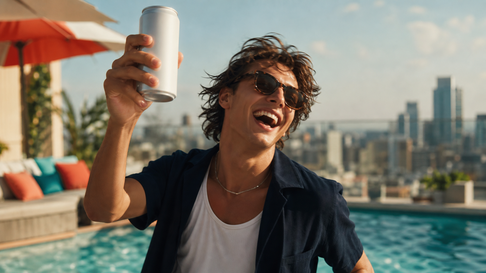
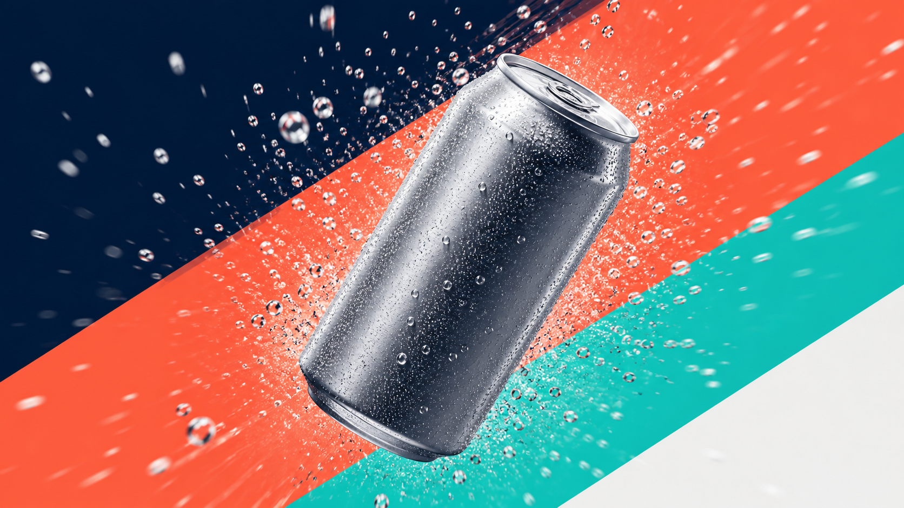

# E1 · Seedance 영상 콘텐츠 하네스

> 대본 한 줄에서 숏폼 광고 영상까지. 촬영 없이, AI 영상(Seedance 최신 버전)으로 콘텐츠를 만든다.

> **📌 이 과정은 선택 학습입니다.**
> 영상·시나리오(대본) 제작이 실제 업무인 실무자만 수강하시면 됩니다. 영상이 아직 여러분 일이 아니라면 지금 꼭 들을 필요는 없습니다. 핵심 과정(C1~C8)을 먼저 수료하고, 실무에서 영상 콘텐츠가 필요해질 때 돌아와도 충분합니다. 콘텐츠·SNS의 게시물 카피·캡션은 C8에서 다루고, 여기 E1은 그 뒤 "영상으로도 만들고 싶을 때" 펼쳐 보는 선택 학습입니다.

## 0. 이 과정 한눈에

- **대상:** 콘텐츠·SNS·퍼포먼스 마케터, 크리에이티브 (영상 제작을 시작하려는 실무자)
- **성격:** 선택 학습(영상·시나리오 실무자용) · **소요:** 약 150분 · **선수과정:** C8(콘텐츠·SNS) 권장
- **사용 하네스:** `video-content-harness` (파이프라인)
- **얻어가는 것:** 숏폼 영상 스토리보드 + 샷별 Seedance 프롬프트 + 편집·자막·배포 가이드, 그리고 재사용 가능한 영상 하네스

> 이 과정은 실제 영상을 "렌더링"하는 도구(Seedance) 사용법과, 그 앞단의 **기획·대본·스토리보드·샷 프롬프트**를 팀으로 뽑는 법을 함께 다룹니다. AI 영상은 매번 조금씩 다르게 나온다는 점(비결정성)을 전제로, 마음에 드는 샷만 다시 만드는 습관을 익힙니다.

## 1. 왜 이 하네스인가

예전엔 영상 한 편에도 촬영·모델·편집이 필요했습니다. 짧은 SNS 영상 하나 만들려 해도 며칠이 걸렸죠.

- **Before:** 아이디어는 있는데 촬영·편집 장벽에 막혀 영상 콘텐츠를 못 낸다.
- **After:** 트렌드 조사 → 대본 → 스토리보드 → **Seedance로 샷 생성** → 편집까지, 한 파이프라인 팀이 처리한다. 실무자는 기획과 검수에 집중한다.

영상은 "찍는 것"에서 "설계하고 생성하는 것"으로 바뀌고 있습니다. 이 하네스는 그 변화를 팀 작업으로 옮겨 줍니다.

## 2. 개념 이해

### Seedance(시드댄스)가 뭔가요
바이트댄스의 **텍스트/이미지 → 영상** 생성 모델입니다. 글로 장면을 묘사하거나(텍스트→영상), 제품 컷 같은 이미지를 넣어(이미지→영상) 움직이는 영상을 만듭니다.

**최신 버전(Seedance 2.5, 2026년 6월 발표)의 강점:**
- 한 번에 **30초짜리 네이티브 클립**(이어붙이기 없이)
- **4K·10bit 색** 화질
- 영상과 **오디오를 동시에** 생성(음악·효과음이 함께 붙음)
- **레퍼런스 이미지를 최대 50장** 동시 입력 → 톤·제품 일관성↑
- 프레임 일부만 다시 그리는 편집, 베타 3분 롱폼

> 안정 배포판은 2.0 계열(블라인드 선호 평가 상위)이고, 2.5는 순차 공개 중입니다. 실제로는 **그때 접근 가능한 최신 버전**을 확인해서 쓰면 됩니다.

### 파이프라인 — 앞 결과가 다음 입력
이 하네스는 **순차 파이프라인**입니다. 조사 결과가 대본으로, 대본이 스토리보드로, 스토리보드가 영상 프롬프트로 이어집니다. 앞 단계가 끝나야 다음 단계가 시작됩니다.

### 숏폼 문법 — 첫 3초가 전부
릴스·쇼츠·틱톡은 **훅(0~3초) → 전개 → CTA** 순서로 만듭니다. 첫 샷에서 손이 멈추지 않으면 그 뒤는 보이지 않습니다.

### 샷 프롬프트 6요소
영상 한 샷은 다음 6가지로 묘사합니다: **장면 · 동작 · 카메라 · 조명/무드 · 스타일/색 · 오디오.** 순서대로 쓰면 모델이 안정적으로 해석합니다. 화면에 넣을 문구(자막·로고)는 프롬프트에 쓰지 말고 **편집 단계에서 얹습니다**(오탈자 방지).

## 3. 사용할 하네스 — `video-content-harness`

팀장(오케스트레이터) 하나가 아래 팀원(에이전트)들을 순서대로 조율합니다.

| 순서 | 팀원 | 하는 일 |
|---|---|---|
| 1 | 리서처(researcher) | 숏폼 트렌드·후킹 패턴·레퍼런스 조사 |
| 2 | 콘텐츠 크리에이터(content-creator) | 영상 대본(훅→전개→CTA) |
| 3 | 영상 감독(video-director) | 스토리보드 + 샷별 Seedance 프롬프트 |
| 4 | 비주얼 디자이너(visual-designer) | (선택) 스토리보드 키프레임 스틸 |
| 5 | 아트디렉터(art-director) | 브랜드 톤·상표 안전 검수 |

**트리거 프롬프트(이 팀을 실행):**

```text
영상 하네스를 구성해줘. 제로 슈거 스파클링 음료 "제로톡" 여름 숏폼 캠페인 영상을 만들고 싶어. 트렌드 조사 → 대본 → 스토리보드와 Seedance(최신 버전) 샷 프롬프트 → 브랜드 톤 검수 순서로 진행하고, 릴스/쇼츠(9:16) 3편 분량의 스토리보드와 각 샷 프롬프트, 편집·자막·배포 가이드를 결과로 줘. 상표·문구는 영상에 넣지 말고 편집 단계로 남겨줘.
```

## 3-B. 이 하네스를 직접 만들기 — `/harness` 구성

이 영상 하네스도, harness 플러그인에게 아래 한 문장을 주면 영상 감독을 포함한 파이프라인 팀으로 통째로 만들어집니다. 팀장(오케스트레이터)·팀원(에이전트)·업무 매뉴얼(스킬)이 한 번에 생성됩니다.

> harness 플러그인은 **C1(하네스 첫걸음)** 에서 이미 설치했다고 가정합니다. 아직이라면 C1의 설치 안내를 먼저 따르세요(보통 관리자가 미리 설치해 둡니다).

**이 하네스를 만드는 구성 프롬프트 — 그대로 입력하세요**

```text
하네스 구성해줘. 최신 Seedance로 숏폼 광고 영상을 만드는 파이프라인 팀이 필요해. 트렌드를 조사하는 리서처 → 대본을 쓰는 콘텐츠 크리에이터 → 스토리보드와 샷별 Seedance 영상 프롬프트를 만드는 영상 감독 → 브랜드 톤과 상표 안전을 검수하는 아트디렉터 순서야. 스토리보드와 샷 프롬프트, 편집·배포 가이드를 결과로 주고, 다른 캠페인에도 다시 쓸 수 있게 만들어줘.
```

**무엇이 만들어지나요**

| 종류 | 생성물 |
|---|---|
| 팀원(에이전트) | `researcher`, `content-creator`, `video-director`(영상 감독·신규), `visual-designer`, `art-director` |
| 업무 매뉴얼(스킬) | `market-research`, `content-production`, `seedance-video`(Seedance 매뉴얼·신규), `visual-concepting`, `creative-direction` |
| 팀장(오케스트레이터) | `video-content-harness` — 파이프라인(영상) |

> 이 저장소의 `.claude/agents/video-director.md`, `.claude/skills/seedance-video/`, `.claude/skills/video-content-harness/`에 실제로 이렇게 생성된 결과가 들어 있습니다. harness는 6단계로 팀을 만들고, "영상 감독에게 오디오 설계도 맡겨줘"처럼 피드백을 주면 계속 진화시킬 수 있습니다.

**만든 다음에는** 아래 4장 실습의 트리거 프롬프트로 이 팀을 실행하면 됩니다.

## 4. 실습 — "제로톡" 여름 숏폼 영상 캠페인

**미션:** 제로톡 여름 캠페인용 릴스/쇼츠 3편의 스토리보드 + 샷별 Seedance 프롬프트 + 배포 가이드를 만든다.

**① 위 트리거 프롬프트를 복사해 입력한다.**

**② 단계별로 따라 하기**

| 단계 | 할 일 | 이렇게 되면 성공 |
|---|---|---|
| 1 | 영상 하네스 구성 → 리서처·콘텐츠·영상감독·아트디렉터 파이프라인 확인 | 5인 파이프라인 팀 구성 |
| 2 | 브랜드·플랫폼(릴스/쇼츠)·주제 입력 | 숏폼 트렌드 조사 결과 |
| 3 | 대본 3편(훅→전개→CTA) 수령 | 첫 3초 훅이 분명함 |
| 4 | 샷별 Seedance 프롬프트(6요소) 확인 | 장면·동작·카메라·조명·색·오디오 포함 |
| 5 | (선택) 키프레임 스틸 생성 | 스토리보드 미리보기 |
| 6 | 아트디렉터 검수 → 상표·문구 없는지 확인 | 상표 미포함, 톤 통과 |
| 7 | Seedance에서 실제 샷 생성 → 육안 검수 → 미달 샷만 재생성 | 마음에 드는 샷 확보 |

> **③ 실제 생성은 Seedance에서:** 하네스가 준 샷 프롬프트를 접근 가능한 최신 Seedance(2.5 또는 그 이상)에 넣어 영상을 만듭니다. 같은 프롬프트도 매번 조금씩 다르게 나오니, 좋은 샷의 설정을 기록해 재사용하세요.

## 5. 완성형 사례

아래는 이 하네스로 만든 **제로톡 여름 숏폼 영상 캠페인** 산출물입니다. 전문은 [완성형 사례 — Seedance 영상 캠페인](../사례/E1_시드댄스_영상캠페인.md)에서 볼 수 있습니다.

세 편의 대표 키프레임(스토리보드 스틸) 컨셉:


*컨셉 A · 청량 제품 필름: 물방울과 스플래시가 튀는 히어로 샷*


*컨셉 B · 라이프스타일: 웃으며 캔을 드는 여름 한 컷*


*컨셉 C · 그래픽 모션: 탄산 버스트를 뚫고 나오는 역동 샷*

각 컨셉은 3~5개 샷으로 나뉘고, 샷마다 Seedance 프롬프트(6요소)와 길이·비율(9:16)·오디오 방향이 붙습니다. (모든 브랜드·수치는 교육용 예시 데이터입니다.)

## 6. 자주 하는 실수

- **훅이 약하다** → 가장 강한 샷을 맨 앞 3초로 옮기세요.
- **한 샷에 정보 과다** → 한 샷 = 한 메시지로 쪼개세요.
- **프롬프트에 상표·문구 요구** → 무지 제품 + 색·무드로 표현하고, 자막·로고는 편집에서 얹으세요(오생성·권리 리스크 예방).
- **비율 혼동** → 릴스·쇼츠·틱톡은 9:16, 유튜브 가로는 16:9로 나눠 만드세요.
- **첫 결과 무비판 수용** → 반드시 육안 검수 후 미달 샷만 재생성하세요.

## 7. 체크리스트 & 자기평가

### 완주 체크리스트

- [ ] 영상 하네스를 `/harness`로 직접 구성해 보았다
- [ ] 대본이 훅(3초)→전개→CTA 구조를 갖췄다
- [ ] 각 샷 프롬프트에 6요소(장면·동작·카메라·조명·색·오디오)가 들어 있다
- [ ] 상표·문구를 프롬프트에서 빼고 편집 단계로 남겼다
- [ ] 플랫폼별 비율(9:16 / 16:9)을 맞췄다
- [ ] 미달 샷만 골라 재생성해 보았다(전체 재생성 아님)

### 자기평가 루브릭 (R-E1 · 70점 통과)
- 파이프라인 이해(20) · 샷 프롬프트 품질(30) · 브랜드/상표 안전(20) · 훅·플랫폼 최적화(20) · 재사용성(10)

## 8. 다음 여정

이 선택 과정으로 **콘텐츠가 정지 이미지에서 영상까지** 확장됐습니다. 여기서 배운 파이프라인·검수·재생성 습관을 여러분의 실제 브랜드 영상에 적용해 보세요.

영상 제작은 선택 학습이므로, 이 과정을 마쳤다면 핵심 트랙으로 돌아가면 됩니다. 게시물 카피·캡션 중심의 콘텐츠·SNS는 **C8(콘텐츠·SNS 제작)** 에서 다룹니다. 필요할 때 이 E1으로 다시 돌아와 영상 하네스를 꺼내 쓰세요.

<!-- web: nav prev=course8-content next=none -->
